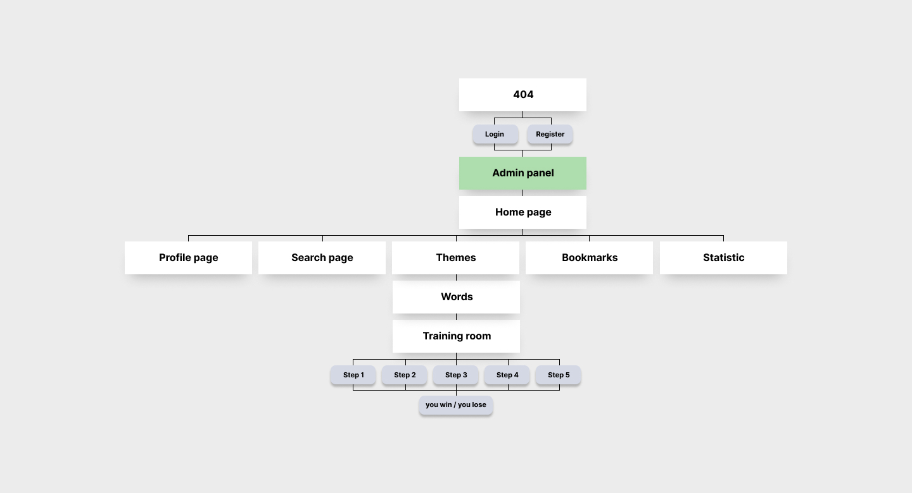

# WortKraft App

Web application for learning German words from current German textbooks in private and general education.  
Target group: people attending German integration courses or those who want to improve their vocabulary on their own.

## Application structure:

