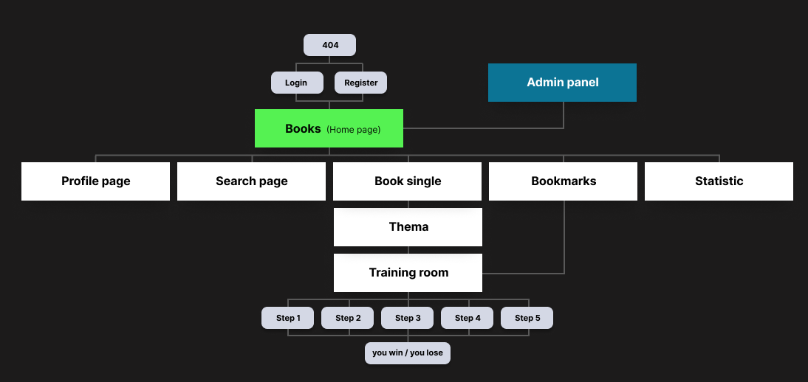

# WortKraft App

Web application for learning German words from current German textbooks in private and general education.  
Target group: people attending German integration courses or those who want to improve their vocabulary on their own.

### Required Tasks:

- Display all base pages ( Home / Book / Thema / Word / Profile / Search / Bookmarks / Statistic)
- Semantic cross-browser layout of the mobile version of the application (Mobil first)
- User registration and authorisation (full CRUD functionality on the Profile page)
- Creating roots for the database
- Creation and filling (partial) of MongoDB database, connection to API
- Output all types of collections from the database using SWR
- Implementing all 5 steps of word learning.

## Optional tasks:

- Desktop version of the application
- Admin panel
- Scroll animation
- Voice relay of words and dialogues

## <b style="color:#0C7495;">User Story 1: Page structure and Navigation</b>

<strong>As a user</strong> of a web application, I want to be able to access the main sections of the site via a navigation menu so that I can easily navigate between pages.

#### Description:

We are creating a page structure and a common `Layout` component for a web application. Layout should provide a navigation menu, header and footer on all pages.

### Acceptance Criteria:

1. **Pages**: All page files must be located in the correct folders:

   - HomePage (books): `/index.jsx`
   - BookPage (book single): `/[book]/index.jsx`
   - ThemaPage (book thema): `/[book]/[thema]/index.jsx`
   - LearnRoom (word): `/[book]/[thema]/[id].jsx`
   - SearchPage: `/search/index.jsx`
   - BookmarksPage: `/bookmarks/index.jsx`
   - StatisticPage: `/statistic/index.jsx`
   - ProfilePage: `/profile/index.jsx`
   - AdminPanel: `/admin/index.jsx`

2. **Layout component**:

   - Create a `Layout` component in the `Components` folder
   - Layout must include `Header`, `Main`, `Footer` components.
   - Layout should be connected in `_app.js` file and frame `<Component {...pageProps} />`

3. **Navigation**:

   - `Header` must include `Navigation` component.
   - All links should navigate to the right pages, including dynamic ones, and be displayed as active.
